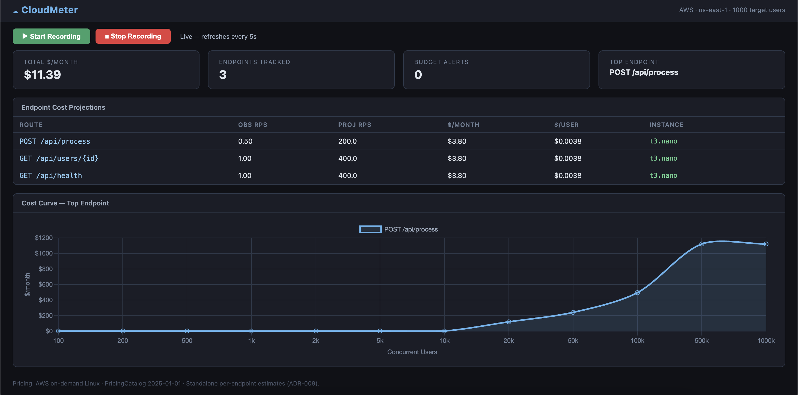

# CloudMeter

> **"Your `/api/export/pdf` endpoint costs $340/month."**
> No APM tool tells you this. CloudMeter does.

[](https://github.com/studymadara/cloudmeter/actions/workflows/ci.yml)
[](https://codecov.io/gh/studymadara/cloudmeter)
[](https://github.com/studymadara/cloudmeter/releases/latest)
[](https://github.com/studymadara/cloudmeter/releases)
[](https://scorecard.dev/viewer/?uri=github.com/studymadara/cloudmeter)
[](LICENSE)
[](https://openjdk.org/)

CloudMeter is a **free, open source Java agent** that attaches to your running JVM and tells you exactly what each API endpoint costs to run on AWS, GCP, or Azure — with no code changes, no cloud credentials, and no SaaS subscription.

One flag. Costs in under 5 minutes.

---

## What it looks like



> The dashboard auto-refreshes every 5 seconds. The cost curve slider lets you explore "what if 10× more users hit this endpoint?"

---

## The problem

APM tools (Datadog, New Relic) show you **performance**. Cost tools (Infracost, AWS Cost Explorer) show you **bills**. Nobody connects the two.

You have no idea which endpoint is eating your cloud budget. Until now.

---

## Quick start

**Download** the latest JAR from [Releases](https://github.com/studymadara/cloudmeter/releases), then add one flag:

```bash
java -javaagent:cloudmeter-agent.jar=provider=AWS,region=us-east-1,targetUsers=10000,budget=500 \
     -jar myapp.jar
```

Open **[http://localhost:7777](http://localhost:7777)** — your cost dashboard is live.

1. Click **Start Recording**
2. Exercise your app (manually or run your test suite)
3. Click **Stop Recording**
4. See cost per endpoint, ranked by impact

**All agent args** (comma-separated `key=value`, all optional):

| Arg | Default | Description |
|---|---|---|
| `provider` | `AWS` | Cloud provider: `AWS`, `GCP`, or `AZURE` |
| `region` | `us-east-1` | Cloud region for pricing |
| `targetUsers` | `1000` | Concurrent users to project cost at |
| `rpu` | `1.0` | Requests per user per second |
| `budget` | `0` | Monthly USD budget alert (0 = off) |
| `port` | `7777` | Dashboard port |
| `fetchPrices` | `false` | Fetch latest prices from CloudMeter repo at startup |

---

## What you get

```
╔══════════════════════════════════════════════════════════════════════════════╗
║  ☁ CloudMeter  v0.2.0          aws / us-east-1          ● Recording  [Stop] ║
╠══════════════════════════════════════════════════════════════════════════════╣
║  ENDPOINT COSTS  (standalone ⓘ)              120s recorded  •  359 requests ║
║  ┌──────────────────────────────┬──────────┬───────┬───────┬──────────────┐ ║
║  │ Endpoint                     │ p50/mo   │ p95   │ Ratio │ Relative     │ ║
║  ├──────────────────────────────┼──────────┼───────┼───────┼──────────────┤ ║
║  │ POST /api/export/pdf         │ $298     │ $342  │ 1.1×  │ ████████████ │ ║
║  │ GET  /api/users/{id}       ⚠ │ $ 11     │ $ 43  │ 3.8×  │ ██           │ ║
║  │ GET  /api/products           │ $  4     │ $  5  │ 1.2×  │ ▌            │ ║
║  └──────────────────────────────┴──────────┴───────┴───────┴──────────────┘ ║
║  ⚠ GET /api/users/{id} — p95 is 3.8× median. Missing index on key values?  ║
╚══════════════════════════════════════════════════════════════════════════════╝
```

**Cost variance** is the killer feature: when some requests to the same endpoint cost 3× more than others, CloudMeter surfaces it. That's a missing DB index, not a traffic spike.

---

## How it works

CloudMeter uses a Java agent (`-javaagent`) to instrument your JVM at the bytecode level — the same technique used by the OpenTelemetry Java agent and AppDynamics. It intercepts every HTTP request without touching your source code.

For each request:

| Signal | How | Why it matters |
|---|---|---|
| **CPU core-seconds** | `ThreadMXBean.getThreadCpuTime()` — exact, not sampled | Direct compute cost |
| **Thread wait ratio** | State sampling at 10 ms intervals | `0.6` = 60% idle — you're paying for nothing |
| **Peak memory** | JVM heap metrics | Memory-bound instance sizing |
| **Egress bytes** | Response output stream | Network cost (approximate) |

Cost is projected using public cloud on-demand pricing — **no credentials, no cloud API calls**.

---

## Live pricing

By default CloudMeter uses pricing tables embedded in the JAR (verified against public pricing pages). To fetch the latest prices at startup:

```bash
java -javaagent:cloudmeter-agent.jar=provider=AWS,fetchPrices=true -jar myapp.jar
```

CloudMeter fetches `pricing/cloudmeter-prices.json` from this repository in a background thread. If the fetch fails (no network, etc.) it falls back to the embedded prices silently. The dashboard footer shows `⬤ Live · 2026-03-22` or `● Static · 2025-01-01` so you always know which prices are active.

---

## Dynamic attach

Attach to a **running** JVM without a restart:

```bash
cloudmeter attach <pid> --agent-jar /path/to/cloudmeter-agent.jar \
  --provider AWS --region us-east-1 --users 5000
```

Requires a JDK installation (Java 11+). The dashboard starts at `:7777` immediately after attach.

---

## CI/CD cost gate

```bash
# Fail the build if any endpoint exceeds $500/month at projected load
cloudmeter report --format json --budget 500 > cost-report.json
echo $?   # 1 if any endpoint breaches the budget, 0 otherwise
```

Attach `cost-report.json` as a CI artifact to track costs over time.

---

## Docker

```dockerfile
FROM eclipse-temurin:21-jre
COPY cloudmeter-agent.jar /opt/cloudmeter/agent.jar
COPY your-app.jar /app.jar
ENV JAVA_TOOL_OPTIONS="-javaagent:/opt/cloudmeter/agent.jar=provider=AWS,region=us-east-1,targetUsers=1000"
EXPOSE 8080 7777
CMD ["java", "-jar", "/app.jar"]
```

> **Security**: Port 7777 is local-only by design. Do not expose it via a LoadBalancer or Ingress — use `kubectl port-forward` for access.

## Kubernetes

```yaml
initContainers:
  - name: cloudmeter-agent
    image: busybox
    command:
      - sh
      - -c
      - wget -O /agent/cloudmeter-agent.jar
          https://github.com/studymadara/cloudmeter/releases/latest/download/cloudmeter-agent.jar
    volumeMounts:
      - name: agent-vol
        mountPath: /agent

containers:
  - name: your-app
    env:
      - name: JAVA_TOOL_OPTIONS
        value: "-javaagent:/agent/cloudmeter-agent.jar=provider=AWS,region=us-east-1,targetUsers=1000"
    ports:
      - containerPort: 8080
      - containerPort: 7777
    volumeMounts:
      - name: agent-vol
        mountPath: /agent

volumes:
  - name: agent-vol
    emptyDir: {}
```

---

## Supported environments

| Environment | Status |
|---|---|
| Java 8 | ✅ agent compiled `--release 8` |
| Java 11, 17, 21 | ✅ smoke-tested |
| Spring Boot 3.x (jakarta.servlet / Tomcat 10) | ✅ smoke-tested |
| Spring Boot 2.x (javax.servlet / Tomcat 9) | ✅ smoke-tested |
| Raw Servlet API (embedded Tomcat, no Spring) | ✅ smoke-tested |
| JAX-RS (Jersey 2.x on Tomcat) | ✅ smoke-tested |
| Spring `@Async` context propagation | ✅ |
| `CompletableFuture` / ForkJoinPool | ✅ |
| Spring WebFlux / Project Reactor | ❌ v2 (reactive model incompatible with ThreadLocal) |
| GraalVM native image | ❌ not supported (`-javaagent` does not work on native) |
| Virtual threads (Java 21) | ❌ v1 (`ThreadMXBean` CPU time unreliable for virtual threads) |

---

## What CloudMeter does NOT do

- Read your cloud account (no credentials ever required)
- Capture request or response body content (route, method, status, byte counts only — GDPR safe)
- Model downstream costs: DynamoDB, RDS, SQS, Lambda (v1 is compute only)
- Replace your APM tool (it complements it)

---

## Building from source

```bash
git clone https://github.com/studymadara/cloudmeter.git
cd cloudmeter
./gradlew :agent:shadowJar          # build fat JAR → agent/build/libs/agent-*.jar
./gradlew test jacocoTestReport     # run tests + coverage
bash scripts/e2e.sh                 # full agent e2e smoke test (requires JARs built first)
```

---

## Project structure

```
cloudmeter/
├── agent/             AgentMain (premain + agentmain), HttpInstrumentation (Byte Buddy),
│                      ThreadStateCollector, ContextPropagatingRunnable
│
├── collector/         RequestContext, MetricsStore (ring buffer), RouteStatsCalculator
│                      Route normalisation · p50/p95/p99 variance tracking
│
├── cost-engine/       CostProjector, PricingCatalog (AWS/GCP/Azure), LivePricingFetcher
│                      Linear scaling model · instance selection · cost curve generation
│
├── reporter/          TerminalReporter, JsonReporter, DashboardServer (:7777)
│                      dashboard.html — SPA with Chart.js cost curves, 5 s auto-refresh
│
├── cli/               CloudMeterCli, ReportCommand, CliArgs
│
├── integration-test/  Full pipeline JUnit tests (MetricsStore → reporters → CLI exit codes)
│
├── test-apps/         Sample apps for local and CI e2e testing
│   ├── spring3/       Spring Boot 3.x (primary — used in CI e2e job)
│   ├── spring2/       Spring Boot 2.x
│   ├── servlet/       Raw Servlet / embedded Tomcat
│   └── jaxrs/         JAX-RS / Jersey / embedded Tomcat
│
├── pricing/           cloudmeter-prices.json — fetched at runtime with fetchPrices=true
└── scripts/           e2e.sh, measure-overhead.sh
```

Architecture decisions and full system design: [`arc42.md`](arc42.md)

---

## Contributing

Good first areas:
- Regional pricing multipliers (cost-engine)
- Additional framework support (Micronaut, Quarkus)
- Dashboard improvements
- Language agents (Node.js, Python) following the same wire protocol

Read [`arc42.md`](arc42.md) before contributing — it explains every architectural decision and why it was made. Read [`CONTRIBUTING.md`](CONTRIBUTING.md) for the branching model and PR process.

---

## License

Apache 2.0 — see [LICENSE](LICENSE).
