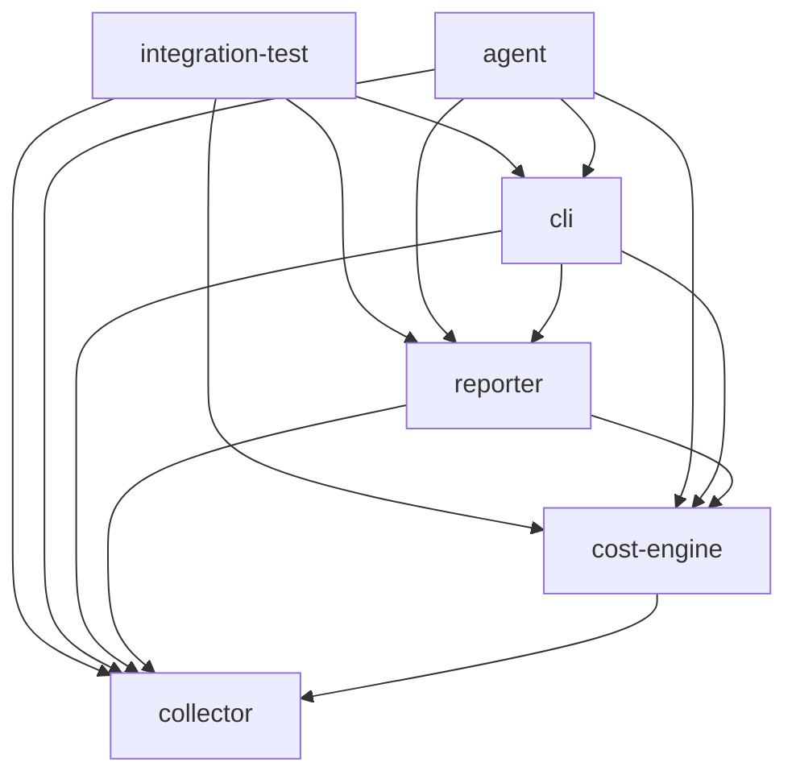
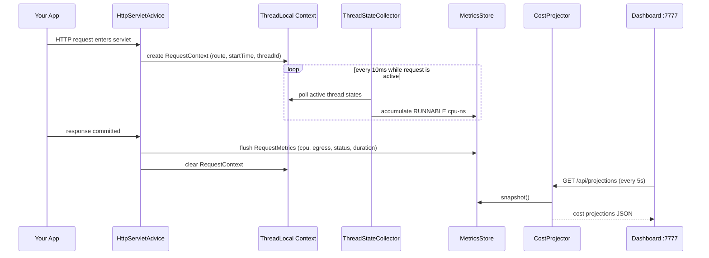

# Architecture

This page summarises the module structure and key architecture decisions. The full design document is [`arc42.md`](../../arc42.md).

## Module map

```
cloudmeter/
├── collector/          Data model and in-memory store
├── cost-engine/        Pricing catalog and projection engine
├── reporter/           Output layer (terminal, JSON, dashboard)
├── cli/                Command-line interface
├── agent/              Fat JAR entry point (bytecode instrumentation)
└── integration-test/   End-to-end pipeline tests
```

## Dependency graph



### collector

Core data types and the in-memory metrics store.

| Class | Responsibility |
|---|---|
| `RequestMetrics` | Immutable value object: one captured HTTP request (route, CPU, egress, status, timestamps) |
| `RequestContext` | ThreadLocal context propagated through the call stack for the duration of a request |
| `MetricsStore` | Thread-safe in-memory store; `startRecording()` clears and begins accumulation; `getAll()` returns a snapshot |
| `RouteStatsCalculator` | Computes p50/p95/p99 cost distribution per route from a `MetricsStore` snapshot |
| `ContextPropagatingRunnable` | Wraps `Runnable` submissions to preserve `RequestContext` across async thread hand-offs |

### cost-engine

Projection formula and pricing data.

| Class | Responsibility |
|---|---|
| `CostProjector` | Static `project(metrics, config)` method — implements the 6-step formula, produces `EndpointCostProjection` list sorted by monthly cost |
| `EndpointCostProjection` | Immutable projection result for one route: cost at target scale, cost curve, budget flag |
| `ProjectionConfig` | Projection parameters: provider, region, targetUsers, rpu, budget, recordingDuration |
| `PricingCatalog` | Static pricing tables for AWS, GCP, Azure — instance types and egress rates |
| `CloudProvider` | Enum: `AWS`, `GCP`, `AZURE` |
| `InstanceType` | Instance name, provider, vCPU count, memory GiB, hourly USD |
| `ScalePoint` | One point on the cost curve: (concurrentUsers, monthlyCostUsd) |

### reporter

Output layer — three independent reporters, all stateless.

| Class | Responsibility |
|---|---|
| `TerminalReporter` | Prints a fixed-width table to a `PrintStream`. Budget-exceeding rows marked with `!!`. |
| `JsonReporter` | Serialises projections to JSON (no dependencies). Returns `boolean` for CI exit code. |
| `DashboardServer` | Embedded `com.sun.net.httpserver.HttpServer`. Binds to `127.0.0.1` only. Handlers for `/`, `/api/projections`, `/api/recording/start`, `/api/recording/stop`. |

`DashboardServer` constructor takes `(MetricsStore, ProjectionConfig, port)`. Passing port `0` lets the OS pick a free port — used in integration tests to run multiple servers in parallel.

### cli

Command-line interface. No direct dependency on Byte Buddy or instrumentation.

| Class | Responsibility |
|---|---|
| `CliArgs` | Parses the agent arg string (`key=value,...`). `toProjectionConfig()` builds a `ProjectionConfig`. |
| `ReportCommand` | Fetches `/api/projections` from a live dashboard, parses JSON, renders via TerminalReporter or JsonReporter. |
| `JsonProjectionParser` | Regex-based parser for the projections JSON response. Zero dependencies. Re-evaluates `exceedsBudget` against CLI budget when `budgetUsd > 0`. |
| `CloudMeterCli` | `run(args, out, err, cmd)` — fully testable, returns int exit code. |
| `CloudMeterMain` | `main(args)` — calls `CloudMeterCli.run()` and `System.exit()`. Excluded from JaCoCo. |

### agent

The fat JAR. Contains all modules shaded under `io.cloudmeter.shaded.*` to avoid classpath conflicts with user applications.

| Class | Responsibility |
|---|---|
| `AgentMain` | `premain()` + `agentmain()` entry points. Parses agent args, installs Byte Buddy instrumentation, starts `DashboardServer`, registers JVM shutdown hook. |
| `HttpInstrumentation` | Byte Buddy `AgentBuilder` that intercepts `HttpServlet.service()` (covers javax + jakarta) |
| `HttpServletAdvice` | `@Advice` class: `@OnMethodEnter` creates `RequestContext`, `@OnMethodExit` commits metrics to `MetricsStore` |
| `ThreadStateCollector` | Background daemon thread: samples `ThreadMXBean.getThreadInfo()` every 10ms for all active request threads |
| `RouteNormalizer` | Heuristic path segment replacement: digits → `{id}`, UUIDs → `{id}`, slugs → `{id}` |

## Architecture Decision Records

### ADR-001 — Byte Buddy over raw ASM

Byte Buddy provides a type-safe, high-level API that is significantly less brittle across JVM versions than raw ASM. `@Advice` methods work at the bytecode level but are written in plain Java.

### ADR-002 — Java agent over Maven/Gradle library

A Maven library approach would require developers to add a dependency, annotate beans, and configure interceptors — partial coverage guaranteed. A Java agent requires zero source changes and captures all HTTP traffic automatically.

### ADR-003 — Static pricing tables over live cloud API

No credentials, no network dependency, simpler deployment. Accuracy trade-off: tables may be up to 6 months stale. The `pricingDate` field is always emitted so consumers know the age of the data.

### ADR-004 — In-process dashboard over separate process

One JAR, one process. The agent already has all the data; a second process would require IPC. Simpler to install, simpler to troubleshoot.

### ADR-005 — ThreadLocal for request correlation over MDC

Avoids any logging framework dependency. `ThreadLocal` is available in every JVM application. Async hand-off is handled explicitly by `ContextPropagatingRunnable`.

### ADR-006 — Linear scaling model

Honest, auditable, and explainable. The formula is documented precisely so developers understand exactly what the numbers mean. ML-based projection would be a black box and would require training data we don't have.

### ADR-007 — Java 8 bytecode target for agent

The agent module compiles to `--release 8` so it can attach to any JVM from Java 8 onward. Other modules target Java 17. Agent code avoids `var`, records, sealed classes, and other post-8 syntax.

### ADR-008 — Async context propagation via ContextPropagatingRunnable

`@Async`, `CompletableFuture`, and `ExecutorService` submissions hand off to a new thread, losing `ThreadLocal<RequestContext>`. `ContextPropagatingRunnable` wraps submissions at the `Executor` interception point to copy context to the new thread. This covers the most common async patterns in servlet-model applications. Reactive streams (WebFlux, Vert.x) are v2 scope.

### ADR-009 — Standalone cost attribution

Each endpoint's cost is computed as if a dedicated server served only that endpoint. See [Cost Projection Model](Cost-Projection-Model) for full rationale.

### ADR-010 — Fail-safe instrumentation

All agent callbacks are wrapped in `try-catch(Throwable)`. Any failure in CloudMeter code is logged (stderr) and silently swallowed — the user application always continues normally. This is the highest priority non-functional requirement.

### ADR-011 — Dashboard binds to 127.0.0.1 only, no authentication

The dashboard is a developer tool for local use. Binding to localhost prevents accidental public exposure. No auth is added in v1 to keep the installation friction near zero. Users who need remote access should use a reverse proxy with authentication.

## Coverage requirements

| Module | Threshold |
|---|---|
| collector | 99% |
| cost-engine | 99% |
| reporter | 99% |
| cli | 99% |
| agent | 80% (instrumentation code is difficult to unit-test without a live JVM) |
| integration-test | 0% (cross-module behaviour tests, not internal branch coverage) |

## Runtime view — request lifecycle


