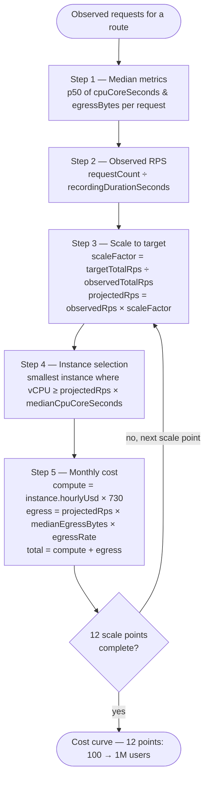

# Cost Projection Model

This page explains exactly how CloudMeter measures, scales, and prices your API endpoints. Understanding this model helps you interpret results and make informed decisions.

## What is measured per request

For every HTTP request your app handles, CloudMeter captures:

| Signal | How it's measured | Why it matters |
|---|---|---|
| **CPU core-seconds** | `ThreadMXBean.getThreadCpuTime()` per thread, summed across all threads serving the request | Direct compute cost — this is what you're paying for |
| **Thread wait ratio** | Background sampler at 10ms intervals checks each active request thread's state (RUNNABLE vs WAITING/BLOCKED) | A ratio of 0.6 means 60% of the time the thread was idle — you're paying for compute that's blocked on I/O |
| **Peak memory (bytes)** | Sampled from JVM heap metrics during request | Used for memory-based instance sizing |
| **Egress bytes** | Response output stream size | Network cost (approximate — response header size, not TCP framing) |
| **Duration (ms)** | Wall-clock time from request entry to response commit | Context for interpreting other signals |
| **HTTP status code** | Response status | Available for filtering; error responses are included in projections (they still cost compute) |

What CloudMeter does **not** capture: request/response body content, headers, query parameters, or any user data. Only metadata.

## Route normalization

CloudMeter groups requests into route templates before computing cost. `/api/users/123` and `/api/users/456` are the same route: `GET /api/users/{id}`.

**Spring MVC:** The route template is read from `HandlerMapping.BEST_MATCHING_PATTERN_ATTRIBUTE` on the request — exact, framework-provided.

**Raw Servlet / JAX-RS:** A heuristic normalizer replaces path segments that look like IDs (all-digits, UUIDs, slugs) with `{id}`. This is an approximation; explicitly configured routes override it.

## The projection formula



Given a set of observed requests for a route, cost is projected as follows:

### Step 1 — Observe median metrics

For each route, take the **median** (p50) of:
- `cpuCoreSeconds` per request
- `egressBytes` per request

Medians are used instead of means to resist outlier pollution (one slow request shouldn't dominate the cost estimate).

### Step 2 — Compute observed RPS

```
observedRps = requestCount / recordingDurationSeconds
```

### Step 3 — Scale to target

```
targetTotalRps = targetUsers × requestsPerUserPerSecond

scaleFactor = targetTotalRps / sum(observedRps across all routes)

projectedRps = observedRps × scaleFactor
```

### Step 4 — Select cheapest instance

Find the cheapest instance type in the pricing catalog where:

```
instance.vCpu >= projectedRps × medianCpuCoreSecondsPerRequest
```

This answers: "What's the smallest instance that can handle this endpoint at the projected load without being CPU-bound?"

### Step 5 — Compute monthly cost

```
monthlyComputeUsd = instance.hourlyUsd × 730

egressGibPerMonth = projectedRps × medianEgressBytes / GIB × 3600 × 24 × 30

monthlyEgressUsd = egressGibPerMonth × egressRatePerGib

projectedMonthlyCostUsd = monthlyComputeUsd + monthlyEgressUsd
```

### Step 6 — Build cost curve

Repeat steps 3–5 at 12 scale points:

```
100, 200, 500, 1000, 2000, 5000, 10000, 20000, 50000, 100000, 500000, 1000000
```

These 12 points form the x-axis of the dashboard chart.

## Standalone attribution model (ADR-009)

Each endpoint's cost is computed as if a **dedicated server** served only that endpoint. Sharing is not modelled.

This means the sum of all projections may exceed your actual server bill. This is intentional:

- It correctly identifies which endpoints are expensive regardless of co-location
- It gives you an actionable "worst case" if you were to isolate each endpoint to its own service
- It avoids the ambiguity of proportional cost models (what proportion do you assign to shared infrastructure?)

All CloudMeter output explicitly labels costs as "standalone projections."

## Accuracy

Target accuracy: **±20% of actual monthly cloud bill** at the stated scale.

Sources of error:
- Thread state sampling is probabilistic (10ms interval). Short requests may have zero samples.
- Instance selection assumes continuous utilisation. Burstable instances (t3, T2, e2-micro) may be cheaper in practice.
- Static pricing tables may be up to 6 months stale. Check `pricingDate` in the JSON output.
- Egress is approximate — response body only; TCP overhead not included.
- Warmup period (first 30s) is excluded; cold-start behaviour is not modelled.

## Cost variance (p50/p95/p99)

Beyond the median, CloudMeter tracks the cost distribution for each route. A high p95/p50 ratio is a signal:

| Ratio | Interpretation |
|---|---|
| 1.0–1.5× | Normal variation |
| 1.5–3.0× | Possible query planning issue or data skew |
| 3.0×+ | Likely a missing index, full table scan on some key values, or N+1 on specific data shapes |

The cost curve chart shows the p50 projection. Variance is shown in the terminal report footer when the ratio exceeds 1.5×.

## Known measurement limitations

| Scenario | Behaviour | Impact |
|---|---|---|
| **Streaming / SSE / chunked responses** | `egressBytes` captures response body size only; TCP framing not included | Egress cost is a floor — actual network cost will be slightly higher |
| **Reverse proxy path rewriting** | CloudMeter sees the path after rewriting; templates reflect framework registration | Routes may differ from what the client sent if a prefix is stripped upstream |
| **Very short requests (< 10ms)** | Thread state sampler at 10ms interval may record zero samples | CPU cost recorded as 0; egress-only cost still accurate |
| **Virtual threads (Java 21 + Spring Boot 3.2+)** | `ThreadMXBean.getThreadInfo()` unreliable for virtual threads | Not supported in v1; use platform threads |
| **GraalVM native images** | `-javaagent` does not work on native-compiled binaries | Out of scope — use the JVM runtime |

## Pricing data

Pricing tables are static, embedded in the agent JAR, and sourced from public AWS, GCP, and Azure on-demand pricing pages. No cloud credentials are ever requested or stored.

The `pricingDate` field in all output indicates when the tables were last updated.
