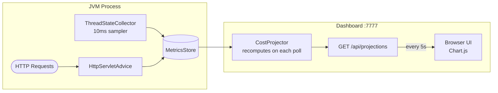

# Dashboard

The CloudMeter dashboard is a single-page web app served by an embedded HTTP server on port 7777 (configurable). It updates automatically every 5 seconds.

## Access

```
http://localhost:7777
```

> The server binds to `127.0.0.1` only. It is not accessible from other machines by default, and has no authentication (ADR-011).

## Layout

### Summary cards

Four cards at the top show:
- **Total monthly cost** — sum of all endpoint projections at your target user count
- **Endpoints tracked** — number of distinct routes observed
- **Budget alerts** — number of endpoints exceeding your configured budget threshold
- **Top endpoint** — the highest-cost route and its monthly cost

### Cost table

Each row represents one API endpoint:

| Column | Description |
|---|---|
| Endpoint | Route template (e.g. `GET /api/users/{id}`) |
| Observed RPS | Requests per second seen during recording |
| Projected RPS | Scaled RPS at target user count |
| Monthly cost | Projected monthly USD at target user count |
| Per user | Cost per user per month |
| Instance | Recommended minimum instance type |

Rows are sorted by monthly cost, highest first. Rows exceeding the budget threshold are highlighted.

### Cost curve chart

A line chart showing projected monthly cost vs concurrent user count, from 100 to 1,000,000 users. One line per endpoint. Helps you see which endpoints scale linearly and which blow up at scale.

## Recording controls

| Button | What it does |
|---|---|
| **Start Recording** | Clears the metrics store and begins accumulating data from scratch |
| **Stop Recording** | Stops accumulation (data is retained; projections remain visible) |

The header shows whether recording is currently active (● Recording) or stopped (○ Stopped).

## Auto-refresh

The dashboard polls `/api/projections` every 5 seconds. All numbers update live without a manual reload.

## Data flow



## API endpoints

The dashboard server exposes these HTTP endpoints directly:

| Method | Path | Description |
|---|---|---|
| `GET` | `/` | Dashboard HTML (single-page app) |
| `GET` | `/api/projections` | JSON cost projections (recomputed on each request) |
| `POST` | `/api/recording/start` | Reset metrics store and start recording |
| `POST` | `/api/recording/stop` | Stop recording (data retained) |

The `/api/projections` response format is the same as the `JsonReporter` output — see [CLI Usage](CLI-Usage) for the schema.

## Using the dashboard in CI/CD

While the dashboard is primarily for local development, you can also point the `cloudmeter report` CLI command at it from a CI pipeline. See [CLI Usage](CLI-Usage).
