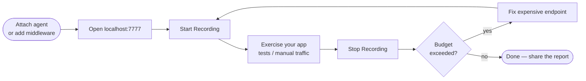

# Getting Started

CloudMeter works with Java (JVM agent), Python (middleware), and Node.js (middleware). Pick your stack below.

- [Java](#java-jvm-agent) — one flag, no code changes
- [Python](#python-flask-fastapi-django) — lightweight middleware, zero required dependencies
- [Node.js](#nodejs-express-fastify) — `require('cloudmeter')` middleware



---

## Java (JVM agent)

### Prerequisites

- Java 8 or later (Java 17+ recommended)
- A running JVM-based web application (Spring MVC, JAX-RS, or raw Servlet)

### 1. Get the agent JAR

**Option A — Build from source:**

```bash
git clone https://github.com/studymadara/cloudmeter.git
cd cloudmeter
./gradlew :agent:shadowJar
# JAR is at: agent/build/libs/agent-0.1.0.jar
```

**Option B — Download release (when available):**

```bash
wget https://github.com/studymadara/cloudmeter/releases/latest/download/cloudmeter-agent.jar
```

### 2. Add the agent flag

Append `-javaagent:cloudmeter-agent.jar=<args>` to your Java command:

```bash
java -javaagent:cloudmeter-agent.jar=provider=AWS,region=us-east-1,targetUsers=5000,budget=200 \
     -jar myapp.jar
```

That's it — no code changes, no config files required.

### 3. Open the dashboard

Navigate to [http://localhost:7777](http://localhost:7777).

You'll see the live dashboard. Metrics start accumulating immediately as your app handles traffic.

### 4. Record a session

1. Click **Start Recording** — this resets the metrics store and begins accumulating fresh data
2. Exercise your app: run integration tests, click through the UI, replay a traffic capture
3. Click **Stop Recording** — projections are computed and the cost table is populated

Aim for at least **30–60 seconds** of representative traffic per endpoint. The warmup period (first 30s after agent attach) is excluded automatically.

### 5. Read the results

The dashboard shows:

- **Cost per endpoint** — projected monthly USD at your target user count
- **Cost curve** — how cost scales from 100 to 1M concurrent users
- **Budget alerts** — endpoints above your configured budget threshold are highlighted

### Next steps

- [Agent Configuration](Agent-Configuration) — tune target users, budget, port, and provider
- [CLI Usage](CLI-Usage) — export reports, add cost gates to CI/CD
- [Cost Projection Model](Cost-Projection-Model) — understand what is being measured and why

### Spring Boot quick start

```bash
# Build your app
./mvnw package

# Start with CloudMeter attached
java -javaagent:cloudmeter-agent.jar=provider=AWS,region=us-east-1,targetUsers=10000,budget=500 \
     -jar target/myapp-1.0.jar

# Dashboard is live at :7777
```

### Docker quick start

```bash
docker run \
  -v $(pwd)/cloudmeter-agent.jar:/agent/cloudmeter-agent.jar \
  -e JAVA_TOOL_OPTIONS="-javaagent:/agent/cloudmeter-agent.jar=provider=AWS,region=us-east-1,targetUsers=5000" \
  -p 8080:8080 \
  -p 7777:7777 \
  myapp:latest
```

> **Security note:** Port 7777 binds to `127.0.0.1` only and has no authentication. Do not expose it publicly — add a reverse proxy with auth if you need remote access.

### Kubernetes quick start

```yaml
initContainers:
  - name: cloudmeter-installer
    image: busybox
    command: ["wget", "-O", "/agent/cloudmeter-agent.jar",
              "https://github.com/studymadara/cloudmeter/releases/latest/download/cloudmeter-agent.jar"]
    volumeMounts:
      - name: cloudmeter-agent
        mountPath: /agent

containers:
  - name: myapp
    env:
      - name: JAVA_TOOL_OPTIONS
        value: "-javaagent:/agent/cloudmeter-agent.jar=provider=AWS,region=us-east-1,targetUsers=5000"
    ports:
      - containerPort: 8080
      - containerPort: 7777   # forward only if you want remote dashboard access
    volumeMounts:
      - name: cloudmeter-agent
        mountPath: /agent

volumes:
  - name: cloudmeter-agent
    emptyDir: {}
```

---

## Python (Flask, FastAPI, Django)

> **Package status:** `pip install cloudmeter` is **planned** but not yet published to PyPI. For now, install from source (see below).

### Prerequisites

- Python 3.8+
- Flask, FastAPI, or Django already in your project

### Install from source

```bash
git clone https://github.com/studymadara/cloudmeter.git
pip install -e cloudmeter/clients/python
```

On first request, the middleware automatically downloads the correct `cloudmeter-sidecar` binary for your platform (~1.4 MB). No Rust required.

### Flask

```python
from cloudmeter.flask import CloudMeterFlask

app = Flask(__name__)
CloudMeterFlask(app, provider="AWS", region="us-east-1", target_users=1000)
```

### FastAPI

```python
from cloudmeter.fastapi import CloudMeterMiddleware

app = FastAPI()
app.add_middleware(CloudMeterMiddleware, provider="AWS", region="us-east-1", target_users=1000)
```

### Django

In `settings.py`:

```python
MIDDLEWARE = [
    'cloudmeter.django.CloudMeterMiddleware',
    # ... your other middleware
]

CLOUDMETER = {
    "provider": "AWS",
    "region": "us-east-1",
    "target_users": 1000,
}
```

### Reading results

Metrics are forwarded to the sidecar process and exposed at [http://localhost:7777](http://localhost:7777) — the same dashboard as the Java agent.

See [Python & Node.js Clients](Python-Node-Clients) for all configuration options.

---

## Node.js (Express, Fastify)

> **Package status:** `npm install cloudmeter` is **planned** but not yet published to npm. For now, install from source (see below).

### Prerequisites

- Node.js 18+
- Express or Fastify already in your project

### Install from source

```bash
git clone https://github.com/studymadara/cloudmeter.git
npm install --prefix cloudmeter/clients/node
```

Then reference the local path in your project:

```bash
npm install ./cloudmeter/clients/node
```

On first request, the middleware automatically downloads the correct `cloudmeter-sidecar` binary for your platform (~1.4 MB). No Rust required.

### Express

```js
const { cloudMeter } = require('cloudmeter')

app.use(cloudMeter({ provider: 'AWS', region: 'us-east-1', targetUsers: 1000 }))
```

### Fastify

```js
const { cloudMeterPlugin } = require('cloudmeter')

await fastify.register(cloudMeterPlugin, { provider: 'AWS', region: 'us-east-1', targetUsers: 1000 })
```

### Reading results

Metrics are forwarded to the sidecar process and exposed at [http://localhost:7777](http://localhost:7777) — the same dashboard as the Java agent.

See [Python & Node.js Clients](Python-Node-Clients) for all configuration options.
