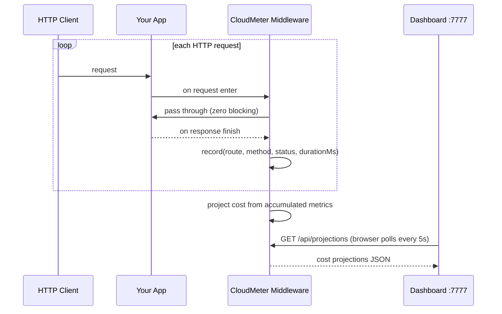

# Python & Node.js Clients

CloudMeter ships lightweight middleware for Python and Node.js web frameworks. Both work the same way:

1. The middleware intercepts each HTTP request and records route, method, status code, and duration.
2. Metrics are processed **in-process** — no sidecar, no subprocess, no binary download.
3. The dashboard is served on `:7777` from within your app process.

No cloud credentials. No code changes beyond adding the middleware.



---

## Install

```bash
# Python
pip install cloudmeter

# Node.js
npm install cloudmeter-sdk
```

---

## Python

### Supported frameworks

| Framework | Minimum version |
|---|---|
| Flask | 1.0+ |
| FastAPI | 0.70+ (requires Starlette 0.20+) |
| Django | 3.2+ |

### Flask

```python
from flask import Flask
from cloudmeter.flask import CloudMeterFlask

app = Flask(__name__)

CloudMeterFlask(
    app,
    provider="AWS",        # "AWS" | "GCP" | "AZURE"
    region="us-east-1",
    target_users=1000,
    budget=500,            # optional — USD/month threshold
    port=7777,             # optional — dashboard port
)
```

### FastAPI

```python
from fastapi import FastAPI
from cloudmeter.fastapi import CloudMeterMiddleware

app = FastAPI()

app.add_middleware(
    CloudMeterMiddleware,
    provider="AWS",
    region="us-east-1",
    target_users=1000,
    budget=500,
    port=7777,
)
```

### Django

In `settings.py`:

```python
MIDDLEWARE = [
    'cloudmeter.django.CloudMeterMiddleware',
    'django.middleware.security.SecurityMiddleware',
    # ...
]

CLOUDMETER = {
    "provider": "AWS",
    "region": "us-east-1",
    "target_users": 1000,
    "budget": 500,       # optional
    "port": 7777,        # optional
}
```

### Configuration reference (Python)

| Parameter | Type | Default | Description |
|---|---|---|---|
| `provider` | str | **required** | Cloud provider: `"AWS"`, `"GCP"`, or `"AZURE"` |
| `region` | str | `"us-east-1"` | Cloud region — used for regional pricing multipliers |
| `target_users` | int | **required** | Concurrent user count to project cost to |
| `budget` | float | `None` | Monthly USD threshold — endpoints over this are flagged |
| `port` | int | `7777` | Local port for the dashboard |

### What is captured

CloudMeter captures only:

- HTTP method (`GET`, `POST`, …)
- Route template (e.g. `/api/users/{id}`, not the raw path `/api/users/42`)
- HTTP status code
- Request duration in milliseconds

**Request and response bodies are never captured.** No user data, no PII, no payload content leaves the process. Metrics are stored only in memory and are never sent to any remote server.

---

## Node.js

### Supported frameworks

| Framework | Minimum version |
|---|---|
| Express | 4.x |
| Fastify | 4.x |

### Express

```js
'use strict'
const express = require('express')
const { cloudMeter } = require('cloudmeter-sdk')

const app = express()

// Register before your routes
app.use(cloudMeter({
  provider: 'AWS',       // 'AWS' | 'GCP' | 'AZURE'
  region: 'us-east-1',
  targetUsers: 1000,
  budget: 500,           // optional — USD/month threshold
  port: 7777,            // optional — dashboard port
}))

app.get('/api/users/:id', (req, res) => {
  res.json({ id: req.params.id })
})

app.listen(3000)
```

### Fastify

```js
'use strict'
const fastify = require('fastify')({ logger: true })
const { cloudMeterPlugin } = require('cloudmeter-sdk')

await fastify.register(cloudMeterPlugin, {
  provider: 'AWS',
  region: 'us-east-1',
  targetUsers: 1000,
  budget: 500,
  port: 7777,
})

fastify.get('/api/products', async (req, reply) => {
  return []
})

await fastify.listen({ port: 3000 })
```

### Configuration reference (Node.js)

| Option | Type | Default | Description |
|---|---|---|---|
| `provider` | string | **required** | Cloud provider: `'AWS'`, `'GCP'`, or `'AZURE'` |
| `region` | string | `'us-east-1'` | Cloud region — used for regional pricing multipliers |
| `targetUsers` | number | **required** | Concurrent user count to project cost to |
| `budget` | number | `undefined` | Monthly USD threshold — endpoints over this are flagged |
| `port` | number | `7777` | Local port for the dashboard |

### Route capture

Express: CloudMeter reads `req.route.path` (set by Express after the handler runs) to capture the route template, not the raw URL. `/api/users/42` is captured as `GET /api/users/:id`.

Fastify: CloudMeter reads `request.routeOptions.url` which Fastify populates with the registered route pattern.

### What is captured

Same as Python — only method, route template, status code, and duration. No bodies, no headers, no PII.

---

## Known limitations

### Streaming responses and SSE

For streaming responses (Server-Sent Events, chunked transfer, file downloads), the middleware records `durationMs` as the time until the **first byte** is flushed, not until the stream closes. `egressBytes` will be `0` because the response size is unknown at the point the middleware hooks the finish event.

This means streaming endpoints will show lower-than-actual costs. Treat their projections as a floor, not a ceiling. Fully-buffered JSON responses are unaffected.

### Reverse proxies and path rewriting

If your app sits behind a reverse proxy that **rewrites the path** before it reaches the framework (e.g. stripping a `/api/v1` prefix), CloudMeter sees the rewritten path, not the original. Route templates will reflect what the framework registered, not what the client sent.

---

## See also

- [Getting Started](Getting-Started) — install and your first recording
- [Rust Client](Rust-Client) — Tower/Axum middleware
- [Dashboard](Dashboard) — using the live cost dashboard
- [Cost Projection Model](Cost-Projection-Model) — how costs are projected
- [Contributing](Contributing) — adding framework support or pricing data
