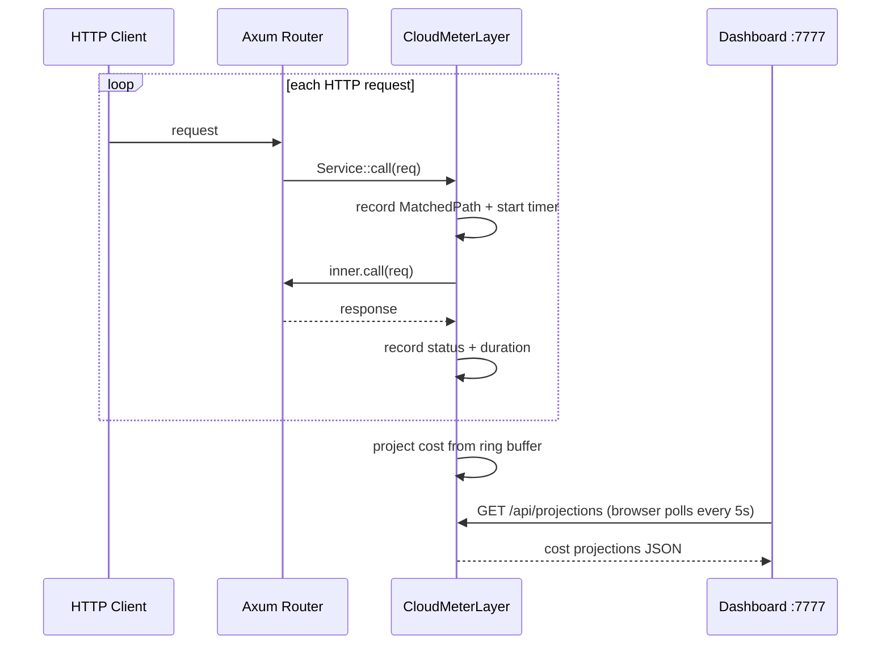

# Rust Client

CloudMeter ships a native Tower middleware for Axum. All cost projection and the dashboard run in-process — no sidecar, no subprocess, no binary to manage.



---

## Install

```bash
cargo add cloudmeter
```

Or in `Cargo.toml`:

```toml
[dependencies]
cloudmeter = "0.5"
```

**Minimum Rust:** 1.70 stable
**Async runtime:** Tokio (required by Axum)

---

## Quick start

```rust
use axum::{Router, routing::get};
use cloudmeter::{CloudMeter, CloudMeterOptions};

#[tokio::main]
async fn main() {
    let cm = CloudMeter::new(CloudMeterOptions {
        provider: "AWS".into(),
        region: "us-east-1".into(),
        target_users: 1000,
        budget: Some(500.0),
        ..Default::default()
    });

    let app = Router::new()
        .route("/api/users/:id",   get(get_user))
        .route("/api/orders",      get(list_orders))
        .route("/api/export/pdf",  get(export_pdf))
        .route_layer(cm.layer()); // must be route_layer, not layer

    let listener = tokio::net::TcpListener::bind("0.0.0.0:3000").await.unwrap();
    axum::serve(listener, app).await.unwrap();
}
```

Open **http://localhost:7777**, click **Start Recording**, exercise your app, see costs per endpoint.

---

## Configuration

```rust
use cloudmeter::CloudMeterOptions;

let opts = CloudMeterOptions {
    provider:     "AWS".into(),       // "AWS" | "GCP" | "AZURE"
    region:       "us-east-1".into(), // cloud region for pricing multiplier
    target_users: 10_000,             // concurrent user count to project to
    budget:       Some(500.0),        // optional USD/month threshold
    port:         7777,               // dashboard port (default: 7777)
    warmup_secs:  30,                 // exclude first N seconds (default: 30)
};
```

### Configuration reference

| Field | Type | Default | Description |
|---|---|---|---|
| `provider` | `String` | **required** | Cloud provider: `"AWS"`, `"GCP"`, or `"AZURE"` |
| `region` | `String` | `"us-east-1"` | Cloud region — used for regional pricing multipliers |
| `target_users` | `u64` | **required** | Concurrent user count to project cost to |
| `budget` | `Option<f64>` | `None` | Monthly USD threshold — endpoints over this are flagged |
| `port` | `u16` | `7777` | Local port for the dashboard |
| `warmup_secs` | `u64` | `30` | Seconds to skip at startup (JIT / class-loading warmup) |

---

## `route_layer()` vs `layer()`

This is the most common gotcha with the Rust client.

| Method | Route templates captured? |
|---|---|
| `.route_layer(cm.layer())` | Yes — `/api/users/42` → `GET /api/users/:id` |
| `.layer(cm.layer())` | No — every request recorded as `UNKNOWN` |

Axum only populates `MatchedPath` (the route template) for middleware registered with `.route_layer()`. Outer `.layer()` calls run before routing, so the template is not yet known.

---

## What is captured

CloudMeter captures only:

- HTTP method (`GET`, `POST`, …)
- Route template (e.g. `/api/users/:id`, not the raw path `/api/users/42`)
- HTTP status code
- Request duration in milliseconds

**Request and response bodies are never captured.** No user data, no PII, no payload content leaves the process.

---

## Dashboard endpoint

The middleware exposes `/__cloudmeter/metrics` on your app's port as a JSON snapshot of current projections. This is separate from the dashboard UI at `:7777`.

```bash
curl http://localhost:3000/__cloudmeter/metrics | jq .
```

---

## Known limitations

### Tower service compatibility

`CloudMeterLayer` implements `tower::Layer` and works with any `tower::Service<Request<Body>>`. It has been tested with Axum. Other Tower-based frameworks (e.g. Warp, Tonic) are untested.

### Streaming responses

For streaming responses (SSE, chunked), `durationMs` is recorded at the point the outer `Future` resolves — this is when the response *headers* are flushed, not when the stream closes. Streaming endpoint costs will be understated.

### Reverse proxies

If a reverse proxy rewrites the path before it reaches Axum, `MatchedPath` reflects the rewritten path. Route templates will match what Axum registered, not the original client path.

---

## See also

- [Getting Started](Getting-Started) — first recording walkthrough
- [Python & Node.js Clients](Python-Node-Clients) — middleware for Flask, FastAPI, Django, Express, Fastify
- [Dashboard](Dashboard) — using the live cost dashboard
- [Cost Projection Model](Cost-Projection-Model) — how costs are projected
- [Contributing](Contributing) — adding framework support or pricing data
